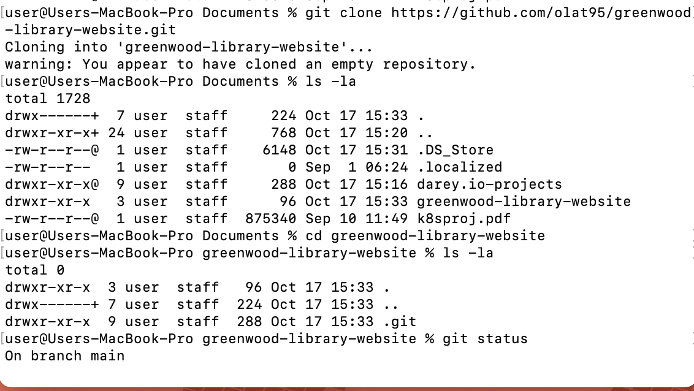

# Greenwood Community Library — Project README

**Project goal:** Simulate a small team (Morgan & Jamie) working together on enhancing the Greenwood Community Library website. This README gives step‑by‑step instructions, example file contents, git commands, PR/merge workflows, and placeholder images so you can practice branching, committing, pushing, creating PRs, and resolving conflicts.

---

## Table of Contents

1. Project overview
2. Repo / local setup
3. File structure and example HTML
4. Initial commit to `main`
5. Morgan's work — `add-book-reviews` branch
6. Jamie's work — `update-events` branch (including pulling latest `main` before PR)
7. Creating PRs

---

## 1) Project overview

Create a repo called `greenwood-library-website`. The main branch contains the base site skeleton (home, about, events, contact). Morgan will add a `book_reviews.html` page in a branch and open a PR. Jamie will update `events.html` in a separate branch and will pull the latest `main` before opening their PR.


---

## 2) Repo / local setup (create on GitHub and clone)

**On GitHub:**

1. Create a new repository named `greenwood-library-website` and initialize with `README.md`.
2. Clone it locally:

```bash
git clone https://github.com/MMuyideen/greenwood-library-website.git
cd greenwood-library-website
```



---

## 3) File structure and example HTML

Create the following files on the `main` branch

**Directory structure**

```
greenwood-library-website/
├─ home.html
├─ about_us.html
├─ events.html
├─ contact_us.html
└─ README.md
```

## 4) Initial commit to `main`

From your local clone (after creating the files):

```bash
git add .
git commit -m "Initial site skeleton"
git push origin main
```


---

## 5) Morgan's work — Add `book_reviews` (branch `add-book-reviews`)

**Local commands (Morgan):**

```bash
git checkout -b add-book-reviews
<Add changes from Morgan>
git add book_reviews.html
git commit -m "Add book reviews section"
git push --set-upstream origin add-book-reviews
```


**Create PR for Morgan's branch**


Merge PR


After merging, update your local `main`:

```bash
git checkout main
git pull origin main
```

## 

## 6) Jamie's work — Update `events.html` (branch `update-events`)

```bash
git checkout -b update-events
<Add changes from Jaime>
git add book_reviews.html
git commit -m "update event"
git push --set-upstream origin update-events

```


**Create PR for Jaime's branch**


Merge PR


After merging, update your local `main`:

```bash
git checkout main
git pull origin main
```

## 
